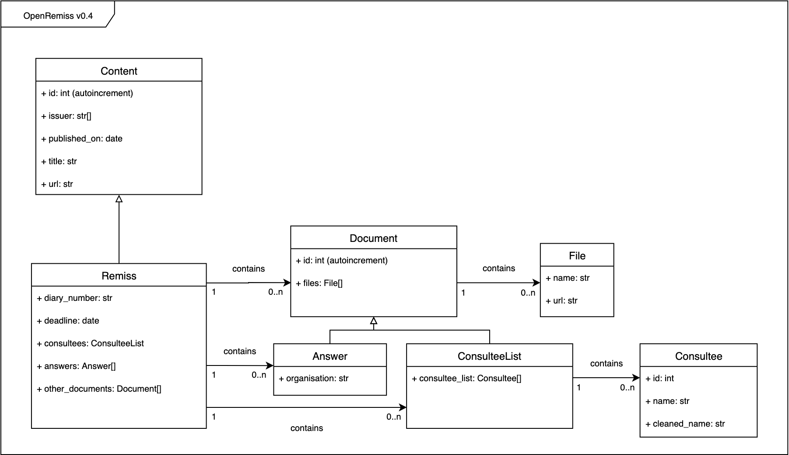

# What data does this script extract?

The following objects are fetched and restructured:
- all the remissprocesses with the following information
  - title
  - department issuing (only the first one if there are several)
  - date of publication
  - a URL to its page on [regeringen.se](regeringen.se/remisser)
  - deadline (**not implemented**)
  - diary number (**not implemented**)

In addition, we attach the following documents to every process:
- a consultee list
- all the answers
- other documents which couldn't be identified as any of the two other categories  

For each consultee list, a structured list is re-generated.

For each answer, the name of the issuing organisation is generated.

## Database structure

To be able to store this information in a structured way, we use a SQL database with a number of tables.

Here is a UML diagram of the classes used in the Python script. Note the inheritance, which means that you will have to join several tables to get all the desired columns.



## Extract data from the Database

To get the data you want, you will need to use SQL queries.

Here is for example the three queries I use for the three tabs of this [spreadsheet](https://docs.google.com/spreadsheets/d/1AIS7-yGfAPyUEFGaXg6gxAv2-7_Q2QQUTiKQJU7weNg/edit?usp=sharing):

### Remiss processes
```sql
SELECT remiss.id, content.published_on, content.issuer, content.title, content.url AS remiss_url, file.url AS consultee_list_url
FROM content, remiss, document, file
WHERE content.id == remiss.id AND document.remiss_id = remiss.id AND document.type == "consultee_list" AND file.document_id == document.id
UNION ALL
SELECT remiss.id, content.published_on, content.issuer, content.title, content.url AS remiss_url, '' AS consultee_list_url
FROM content, remiss
WHERE content.id == remiss.id AND NOT EXISTS (SELECT 1
   FROM document
   WHERE document.type == "consultee_list" AND document.remiss_id == remiss.id
)
```

### Answers

```sql
SELECT document.id, document.remiss_id, file.name as filename, answer.organisation, file.url
FROM document, answer, file
WHERE document.id == answer.id AND file.document_id == document.id
```

### Consultees

```sql
SELECT consultee.id, document.remiss_id, consultee.name, consultee.cleaned_name
FROM document, consultee_list, consultee
WHERE consultee.consultee_list_id = consultee_list.id AND document.id = consultee_list.id
```
